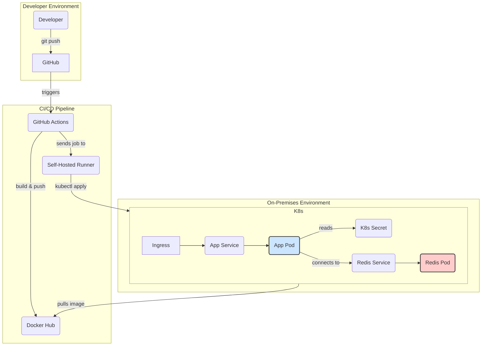

# NestJS Redis K8s DevOps Assignment

## Project Description

This project is a simple NestJS application created for a DevOps test assignment. The main goal is to build a full CI/CD pipeline to deploy the application to a Kubernetes cluster. The application has a single GET `/redis` endpoint that checks the connection to a Redis instance and returns its status.

## Design Decisions

- **Modular Design**: The application is structured into modules to separate concerns. The Redis functionality is encapsulated within its own service (`RedisService`), making it reusable and easier to maintain.
- **Configuration Management**: In Kubernetes, configuration is managed using `ConfigMaps` for non-sensitive data and `Secrets` for sensitive data like passwords. The application is configured to consume these resources directly.
- **Dependency Injection**: NestJS's built-in dependency injection is used to manage the dependencies between components, such as injecting the `RedisService` into the `AppService`.

## Kubernetes Architecture

The following diagram illustrates the on-premises deployment architecture, including the CI/CD pipeline with a self-hosted runner.



## Local Deployment Instructions

These instructions guide you through deploying the application to a local or remote Kubernetes cluster manually.

### Prerequisites

1.  **Clone the repository:**
    ```bash
    git clone https://github.com/your-username/your-repo-name.git
    cd your-repo-name
    ```

2.  **Set Environment Variables:**
    Export the following environment variables in your shell. These will be used to configure the Kubernetes manifests and log in to your container registry.

    ```bash
    export DOCKER_USERNAME="your-dockerhub-username"
    export DOCKER_PASSWORD="your-dockerhub-password"
    export REDIS_PASSWORD="your-super-secret-redis-password"
    ```

### Step 1: Build and Push the Docker Image

1.  **Log in to Docker Hub:**
    ```bash
    echo $DOCKER_PASSWORD | docker login -u $DOCKER_USERNAME --password-stdin
    ```

2.  **Build and push the image:**
    ```bash
    docker build -t $DOCKER_USERNAME/test:latest .
    docker push $DOCKER_USERNAME/test:latest
    ```

### Step 2: Configure and Deploy to Kubernetes

1.  **Update Kubernetes Manifests:**
    The following commands will replace the placeholder values in the Kubernetes manifest files with the environment variables you set earlier. The Redis password will be Base64-encoded as required by Kubernetes Secrets.

    ```bash
    # Update the image in the deployment
    sed -i "s|image: YOUR_DOCKER_REGISTRY/test:latest|image: $DOCKER_USERNAME/test:latest|g" k8s/app.yml

    # Update the Redis password in the secret manifest
    BASE64_REDIS_PASSWORD=$(echo -n $REDIS_PASSWORD | base64)
    sed -i "s/REDIS_PASSWORD: \"\"/REDIS_PASSWORD: $BASE64_REDIS_PASSWORD/g" k8s/secret.yml
    ```

2.  **Apply the manifests to your cluster:**
    ```bash
    kubectl apply -f k8s/
    ```

### Step 3: Verify the Deployment

1.  **Check the status of your pods and services:**
    ```bash
    kubectl get pods
    kubectl get services
    ```
    You should see the `nestjs-app` and `redis` pods in a `Running` state.

2.  **Access the application:**
    Once the application is running, you can access the `/redis` endpoint through the Ingress or by port-forwarding the service:
    ```bash
    kubectl port-forward svc/nestjs-app-service 8080:80
    ```
    Then, open a new terminal and run:
    ```bash
    curl http://localhost:8080/redis
    ```
    
## CI/CD Setup (GitHub Actions)

The CI/CD pipeline is defined in `.github/workflows/ci.yml` and automates the build, push, and deployment process. To make it operational, you need to configure GitHub Secrets and set up a self-hosted runner.

### Step 1: Set Up a Self-Hosted Runner

The `deploy` job in the CI/CD pipeline is configured to run on a `self-hosted` runner. This is necessary because the pipeline needs access to your on-premises or private Kubernetes cluster to deploy the application.

You must set up a self-hosted runner in the environment where your Kubernetes cluster is accessible. For detailed instructions, follow the official GitHub documentation:
- [Adding self-hosted runners](https://docs.github.com/en/actions/hosting-your-own-runners/adding-self-hosted-runners)

Ensure the runner has `kubectl` installed and configured to access your cluster.

### Step 2: Configure GitHub Secrets

Navigate to your GitHub repository's `Settings > Secrets and variables > Actions` and add the following secrets:

-   **`DOCKER_USERNAME`**: Your Docker Hub username. This is used to log in to Docker Hub and tag the image.
-   **`DOCKER_PASSWORD`**: Your Docker Hub password or an access token. This is used to authenticate with Docker Hub.
-   **`REDIS_PASSWORD`**: The password for your Redis instance, **in Base64**. The CI/CD pipeline will inject this directly into the Kubernetes Secret. You can generate the Base64 value with:
    ```bash
    echo -n 'your-super-secret-redis-password' | base64
    ```

### How it Works

The pipeline is triggered on every push to the `main` branch and consists of two jobs:

1.  **`build_and_push`**: This job builds the Docker image and pushes it to your Docker Hub registry.
2.  **`deploy`**: This job runs on your self-hosted runner and performs the following actions:
    -   It uses `sed` to replace the image placeholder in `k8s/app.yml` with the newly built image tag.
    -   It uses `sed` to replace the `REDIS_PASSWORD` placeholder in `k8s/secret.yml` with the value from the GitHub secret.
    -   It applies the updated Kubernetes manifests to your cluster using `kubectl apply`.
