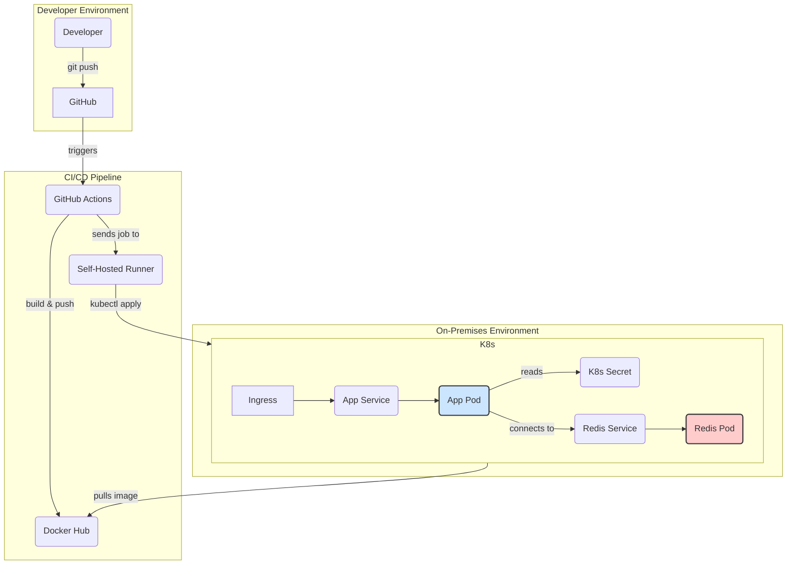

# NestJS Redis K8s DevOps Assignment

## Project Description

This project is a simple NestJS application created for a DevOps test assignment. The main goal is to build a full CI/CD pipeline to deploy the application to a Kubernetes cluster. The application has a single GET `/redis` endpoint that checks the connection to a Redis instance and returns its status.

## Design Decisions

- **Modular Design**: The application is structured into modules to separate concerns. The Redis functionality is encapsulated within its own service (`RedisService`), making it reusable and easier to maintain.
- **Configuration Management**: In Kubernetes, configuration is managed using `ConfigMaps` for non-sensitive data and `Secrets` for sensitive data like passwords. The application is configured to consume these resources directly.
- **Dependency Injection**: NestJS's built-in dependency injection is used to manage the dependencies between components, such as injecting the `RedisService` into the `AppService`.

## Kubernetes Architecture

The following diagram illustrates the on-premises deployment architecture, including the CI/CD pipeline with a self-hosted runner.



## Local Deployment Instructions

These instructions guide you through deploying the application to a local or remote Kubernetes cluster manually.

### Prerequisites

1.  **Clone the repository:**
    ```bash
    git clone https://github.com/your-username/your-repo-name.git
    cd your-repo-name
    ```

2.  **Set Environment Variables:**
    Export the following environment variables in your shell. These will be used to configure the Kubernetes manifests and log in to your container registry.

    ```bash
    export DOCKER_USERNAME="your-dockerhub-username"
    export DOCKER_PASSWORD="your-dockerhub-password"
    export REDIS_PASSWORD="your-super-secret-redis-password"
    ```

### Step 1: Build and Push the Docker Image

1.  **Log in to Docker Hub:**
    ```bash
    echo $DOCKER_PASSWORD | docker login -u $DOCKER_USERNAME --password-stdin
    ```

2.  **Build and push the image:**
    ```bash
    docker build -t $DOCKER_USERNAME/test:latest .
    docker push $DOCKER_USERNAME/test:latest
    ```

### Step 2: Configure and Deploy to Kubernetes

1.  **Update Kubernetes Manifests:**
    The following commands will replace the placeholder values in the Kubernetes manifest files with the environment variables you set earlier. The Redis password will be Base64-encoded as required by Kubernetes Secrets.

    ```bash
    # Update the image in the deployment
    sed -i "s|image: YOUR_DOCKER_REGISTRY/test:latest|image: $DOCKER_USERNAME/test:latest|g" k8s/app.yml

    # Update the Redis password in the secret manifest
    BASE64_REDIS_PASSWORD=$(echo -n $REDIS_PASSWORD | base64)
    sed -i "s/REDIS_PASSWORD: \"\"/REDIS_PASSWORD: $BASE64_REDIS_PASSWORD/g" k8s/secret.yml
    ```

2.  **Apply the manifests to your cluster:**
    ```bash
    kubectl apply -f k8s/
    ```

### Step 3: Verify the Deployment

1.  **Check the status of your pods and services:**
    ```bash
    kubectl get pods
    kubectl get services
    ```
    You should see the `nestjs-app` and `redis` pods in a `Running` state.

2.  **Access the application:**
    Once the application is running, you can access the `/redis` endpoint through the Ingress or by port-forwarding the service:
    ```bash
    kubectl port-forward svc/nestjs-app-service 8080:80
    ```
    Then, open a new terminal and run:
    ```bash
    curl http://localhost:8080/redis
    ```
    
## CI/CD Setup (GitHub Actions)

The CI/CD process is split into two separate pipelines: **Continuous Integration (CI)** and **Continuous Deployment (CD)**.

### Continuous Integration (`.github/workflows/ci.yml`)

The CI pipeline automatically runs on every pull request submitted to the `main` branch. Its purpose is to build, test, and validate the code before it gets merged.

**Workflow:**
1.  **Trigger**: Automatically starts when a pull request is opened or updated against `main`.
2.  **Build**: Builds a Docker image and tags it with `pr-` followed by the branch name (e.g., `your-username/test:pr-feature-branch`).
3.  **Scan**: Performs a vulnerability scan on the newly built image using Trivy. If any `CRITICAL` or `HIGH` severity vulnerabilities are found, the pipeline fails.
4.  **Push**: If the scan is successful, the PR-specific image is pushed to the container registry.
5.  **Test**: A temporary Kubernetes cluster is created using KinD (Kubernetes in Docker), and the application is deployed using the PR-specific image tag. A test is run against the `/redis` endpoint to ensure basic functionality.

This pipeline ensures that code merged into `main` has been successfully built and tested.

### Continuous Deployment (`.github/workflows/cd.yml`)

The CD pipeline is responsible for deploying a validated image to the on-premises environment. This pipeline is **manually triggered**, giving you full control over when a new version is released.

**Workflow:**
1.  **Trigger**: Manually triggered from the GitHub Actions UI.
2.  **Input**: Requires you to specify the **Image Tag** you wish to deploy (e.g., `pr-feature-branch`, `latest`, or a specific release tag).
3.  **Deploy**: The pipeline runs on a self-hosted runner, which has access to the on-premises Kubernetes cluster. It updates the Kubernetes manifests with the specified image tag and applies them.

### Setup Instructions

#### Step 1: Configure GitHub Secrets

Navigate to your GitHub repository's `Settings > Secrets and variables > Actions` and add the following secrets:

-   **`DOCKER_USERNAME`**: Your Docker Hub username.
-   **`DOCKER_PASSWORD`**: Your Docker Hub password or an access token.
-   **`REDIS_PASSWORD`**: The password for your Redis instance.

#### Step 2: Set Up a Self-Hosted Runner

The CD pipeline requires a `self-hosted` runner to deploy to your on-premises Kubernetes cluster.

You must set up a self-hosted runner in an environment where your Kubernetes cluster is accessible. For detailed instructions, follow the official GitHub documentation:
- [Adding self-hosted runners](https://docs.github.com/en/actions/hosting-your-own-runners/adding-self-hosted-runners)

Ensure the runner has `kubectl` installed and configured to access your cluster.
