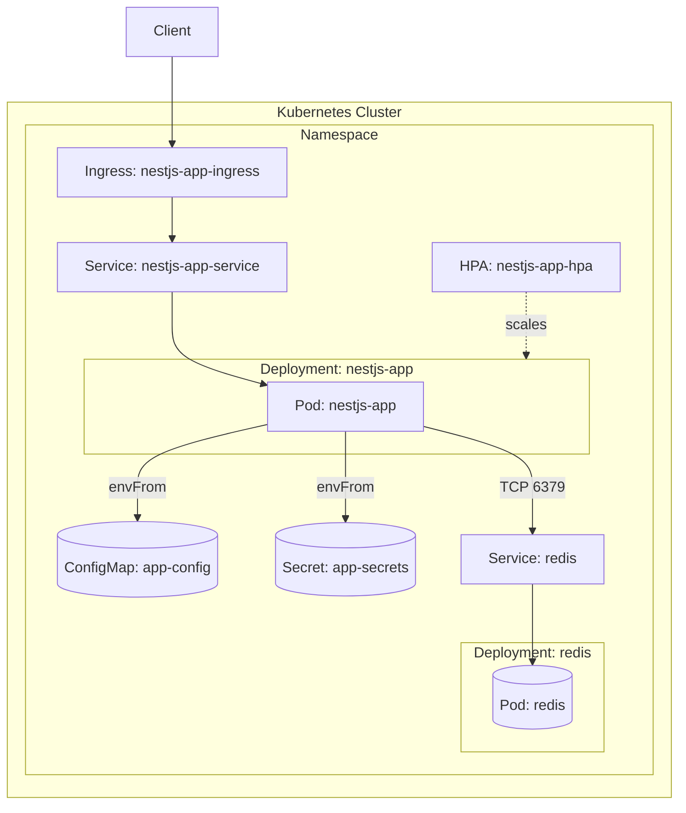
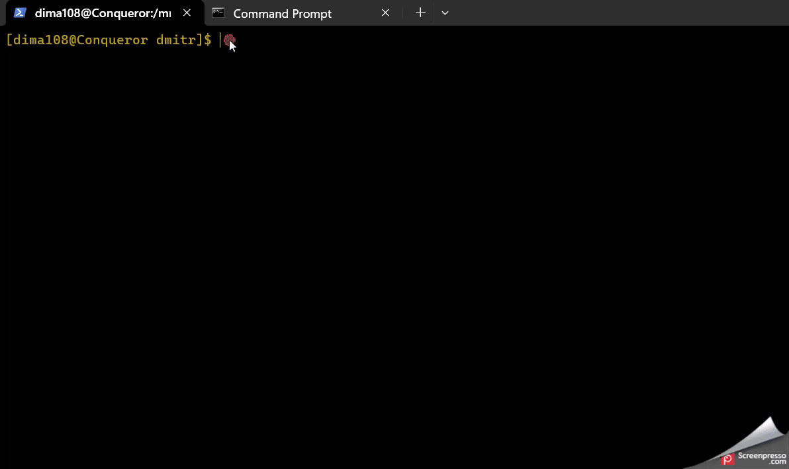

# NestJS Redis K8s DevOps Assignment

## Project Description

Simple NestJS service exposing GET /redis that reports Redis connectivity. Focus is on CI/CD and Kubernetes deployment.

Key files:
- [Dockerfile](Dockerfile)
- [.github/workflows/ci.yml](.github/workflows/ci.yml)
- [.github/workflows/cd.yml](.github/workflows/cd.yml)
- [k8s/app.yml](k8s/app.yml), [k8s/redis.yml](k8s/redis.yml), [k8s/secret.yml](k8s/secret.yml)

## Dockerfile Overview

- Multi-stage build using node:22-alpine
- Production image copies dist, node_modules, and package.json only
- Non-root user (UID/GID 1001) aligned with pod securityContext
- Exposes 3000 and runs node dist/main

## Kubernetes Architecture

The app is deployed with a Deployment, Service, Ingress, ConfigMap, Secret, and HPA. The pod runs as non-root with readOnlyRootFilesystem. Redis is deployed in-cluster and secured via Secret.

### Architecture Diagram



Component mapping:
- Ingress routes HTTP traffic to the Service, which targets the NestJS Pod.
- The Pod runs as non-root (UID/GID 1001) with readOnlyRootFilesystem and liveness/readiness probes on /redis.
- ConfigMap provides REDIS_HOST and REDIS_PORT to the app Pod.
- Secret stores REDIS_PASSWORD and is used by both the app Pod and Redis Deployment.
- HPA scales the nestjs-app Deployment based on 80% CPU utilization.

## Local Deployment Instructions

Prerequisites: kubectl configured, a Kubernetes cluster, and a container registry account (e.g., Docker Hub).

1. Clone and set variables
   ```bash
   git clone https://github.com/your-username/your-repo-name.git
   cd your-repo-name
   export DOCKER_USERNAME="your-dockerhub-username"
   export DOCKER_PASSWORD="your-dockerhub-password or token"
   export REDIS_PASSWORD="your-redis-password"
   export IMAGE_NAME="${DOCKER_USERNAME}/mustage-test"
   export IMAGE_TAG="local"
   ```
2. Log in and build/push image
   ```bash
   echo "$DOCKER_PASSWORD" | docker login -u "$DOCKER_USERNAME" --password-stdin
   docker build -t "${IMAGE_NAME}:${IMAGE_TAG}" .
   docker push "${IMAGE_NAME}:${IMAGE_TAG}"
   ```
3. Update manifests and apply
   ```bash
   # Update image reference in app manifest
   sed -i "s|image: YOUR_DOCKER_REGISTRY/mustage-test:0.1.0|image: ${IMAGE_NAME}:${IMAGE_TAG}|g" k8s/app.yml

   # Encode and set Redis password in Secret manifest
   REDIS_PASSWORD_B64=$(echo -n "$REDIS_PASSWORD" | base64 -w 0)
   sed -i "s/REDIS_PASSWORD: \"\"/REDIS_PASSWORD: $REDIS_PASSWORD_B64/g" k8s/secret.yml

   # Apply in order
   kubectl apply -f k8s/secret.yml
   kubectl apply -f k8s/redis.yml
   kubectl apply -f k8s/app.yml
   ```
4. Test the endpoint
   ```bash
   kubectl port-forward svc/nestjs-app-service 8080:80
   # in another terminal
   curl http://localhost:8080/redis
   ```

## CI/CD Setup (GitHub Actions)

Two workflows implement CI and CD. Images are named "${DOCKER_USERNAME}/mustage-test".

### Continuous Integration (.github/workflows/ci.yml)

Trigger: pull_request to main.

Steps:
- Build Docker image tagged pr-${{ github.event.number }}
- Trivy scan with severity CRITICAL,HIGH; fails on findings
- Create KinD cluster; install and wait for ingress-nginx readiness
- kind load docker-image to avoid pushing before tests
- Replace image placeholder and inject base64 Redis Secret; apply manifests
- Wait for pods ready; then smoke test via Ingress GET /redis with retries
- On success, log in and push the image to the registry

Required secrets: DOCKER_USERNAME, DOCKER_PASSWORD, REDIS_PASSWORD.

### Continuous Deployment (.github/workflows/cd.yml)

Trigger: manual via workflow_dispatch with optional inputs (environment, rel_tag, image_name).

Release job (GitHub runner):
- Computes VERSION v0.1.YYYYMMDDHHMM and REL_TAG rel_v0.1.YYYYMMDDHHMM if rel_tag is not provided
- Creates and pushes immutable Git tag ${VERSION}; checks out the tag
- Logs in to Docker Hub, builds and pushes ${IMAGE_NAME}:${REL_TAG}

Deploy job (self-hosted on-prem):
- Checks out the same ${VERSION} tag
- Replaces image in k8s/app.yml with ${IMAGE_NAME}:${REL_TAG}
- Base64-encodes REDIS_PASSWORD into k8s/secret.yml
- Applies k8s/secret.yml, k8s/redis.yml, k8s/app.yml; waits for redis and nestjs-app rollouts; prints kubectl get pods,svc,ingress

Runner requirements:
- Self-hosted runner with kubectl configured to your on-prem cluster context
- Permissions to apply manifests; Docker not required on deploy job (build happens on GitHub runner)

Configure repository secrets under Settings > Secrets and variables > Actions:
- DOCKER_USERNAME
- DOCKER_PASSWORD
- REDIS_PASSWORD

#### On-prem cluster prerequisite: Install an Ingress Controller

Install ingress-nginx via Helm (recommended):
```bash
kubectl apply -f https://raw.githubusercontent.com/kubernetes/ingress-nginx/main/deploy/static/provider/kind/deploy.yaml

```

Wait for readiness and verify services:
```bash
kubectl wait --namespace ingress-nginx \
  --for=condition=ready pod \
  --selector=app.kubernetes.io/component=controller \
  --timeout=180s

kubectl get pods -n ingress-nginx
kubectl get svc -n ingress-nginx
```

Notes:
- If your cluster has no external LoadBalancer, expose the controller via NodePort or install MetalLB, and point your DNS (e.g., domain.tld) to a Node IP.
- If your controller requires an explicit class, set spec.ingressClassName: nginx in k8s/app.yml.
- 
## How to Test the App

After deployment, verify pods, services, and the /redis endpoint via Ingress. Ensure domain.tld resolves to your Ingress or Node IP, then run:
```bash
kubectl get pods 
kubectl get services 
curl http://domain.tld/redis 
```



## Kubernetes Manifests Overview

- [k8s/app.yml](k8s/app.yml): Deployment, Service, Ingress, ConfigMap, HPA. App runs as UID/GID 1001, non-root, readOnlyRootFilesystem, with probes on /redis. Resources requests/limits and HPA target 80% CPU.
- [k8s/redis.yml](k8s/redis.yml): Redis Deployment + Service. Requires REDIS_PASSWORD from Secret; uses redis:7.0-alpine.
- [k8s/secret.yml](k8s/secret.yml): Opaque Secret with base64 REDIS_PASSWORD.

## Notes and Troubleshooting

- In Kind, Ingress may not expose a LoadBalancer IP; the CI workflow falls back to Node IP or localhost and retries requests.
- If readiness probes fail, check logs and ensure Redis password matches the Secret:
   ```bash
   kubectl logs -l app=nestjs-app --tail=100
   kubectl logs -l app=redis --tail=100
   ```
- Ensure the image placeholder in k8s/app.yml is replaced during both CI and CD before applying manifests.
